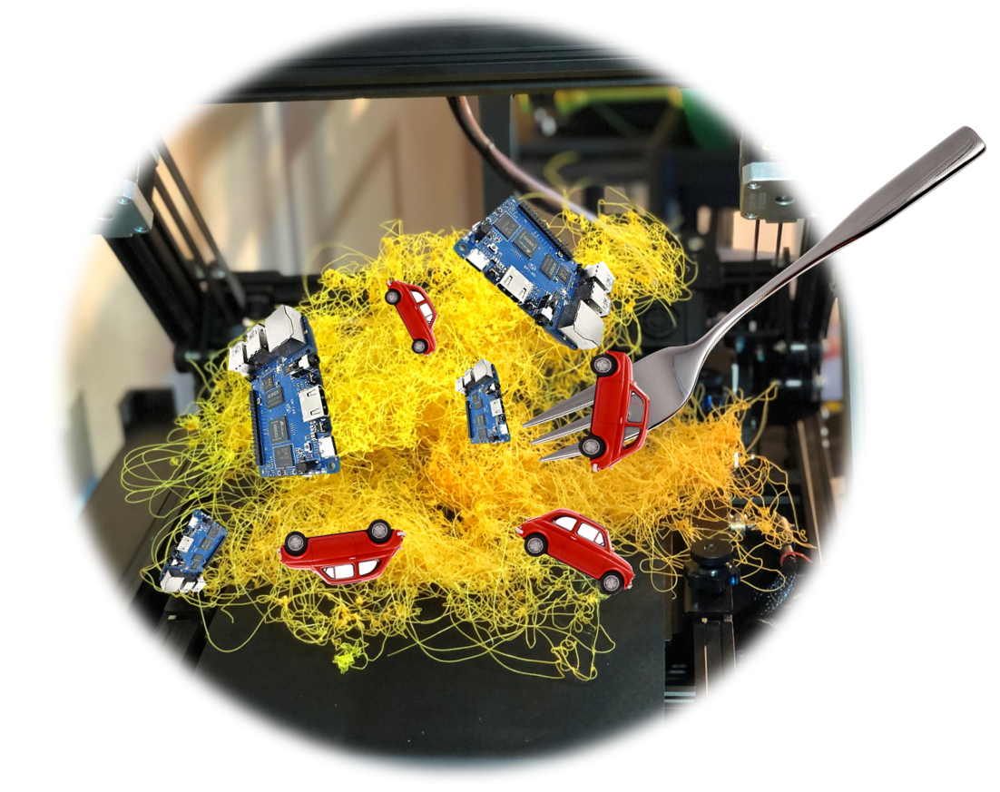
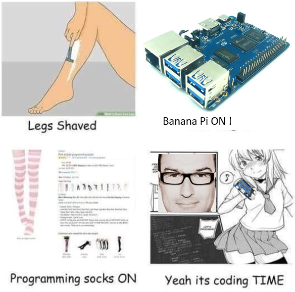

  

# octoprint_install
These files provide a simple script that will install OctoPrint and a video streamer (mjpg-streamer or ustreamer) on virtually any linux based system. The system must use systemd. However we are not in a virtual world and it wont work.

# How to use
* All commands assume you are operating out of your home directory using a terminal directly on the machine or by ssh.
* Install Ubuntu 20+, Mint 20.3+, Debian, DietPi, RPiOS, Armbian, Fedora35+, or ArchLinux on your system (make sure your user is admin for sudo).
* Install git if it isn't already: `sudo apt install git` or `sudo dnf install git` or `sudo pacman -S git`.
* run the command `git clone https://github.com/paukstelis/octoprint_install.git`.
* run the command `sudo octoprint_install/octoprint_install.sh`.
* Choose `Install OctoPrint`
* You will asked if you want to install haproxy and if you want to establish the admin user and do the first run settings with the command-line.
* You will be asked if you want to install recommended plugins.
* You can now connect to your OctoPrint instance (http://ipaddress:5000, http://hostname.local:5000, or if you used haproxy, no need to include port 5000)
* OctoPrint will always be started at boot.
* You can add a USB webcam by choosing the selection in the menu. Your camera service will be setup in /etc/systemd/system/cam_octoprint.service, and will be started upon boot
* NOTE: RPi cameras are not supported through this method, but can be installed manually.

## Kiosk installer for banana pi
Small installer script to setup a minimal kiosk with Chromium for banana pi. This installer isbased on : (http://willhaley.com/blog/debian-fullscreen-gui-kiosk/).

### how to use it
* Login as root or with root permissions
* Download this installer, make it executable and run it

  `wget https://raw.githubusercontent.com/josfaber/debian-kiosk-installer/master/kiosk-installer.sh; chmod +x kiosk-installer.sh; ./kiosk-installer.sh`

# After Eatin the carbanana put your Programing socks on and it is Coding Time !!!

  

